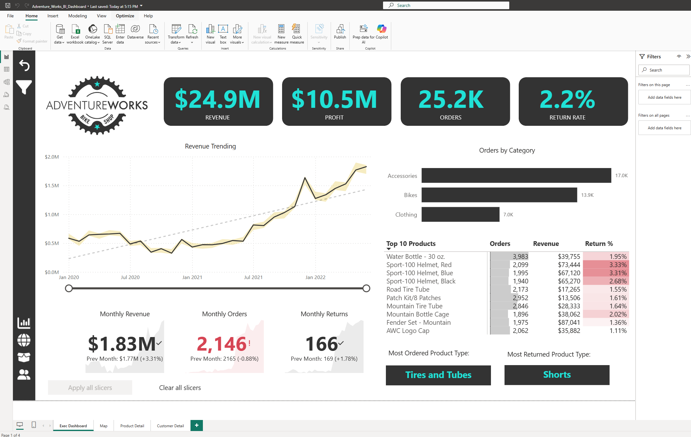
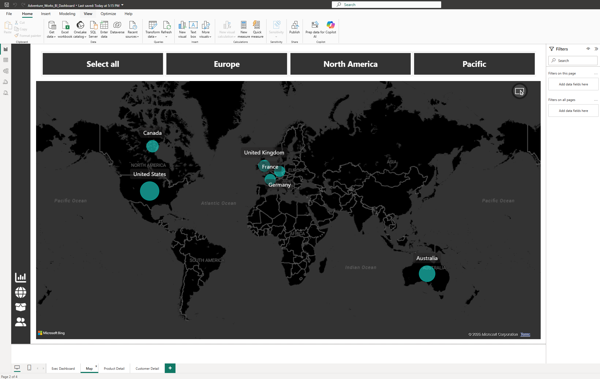
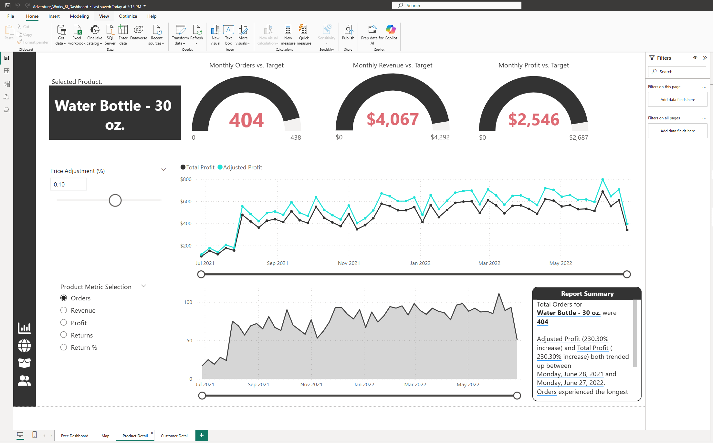
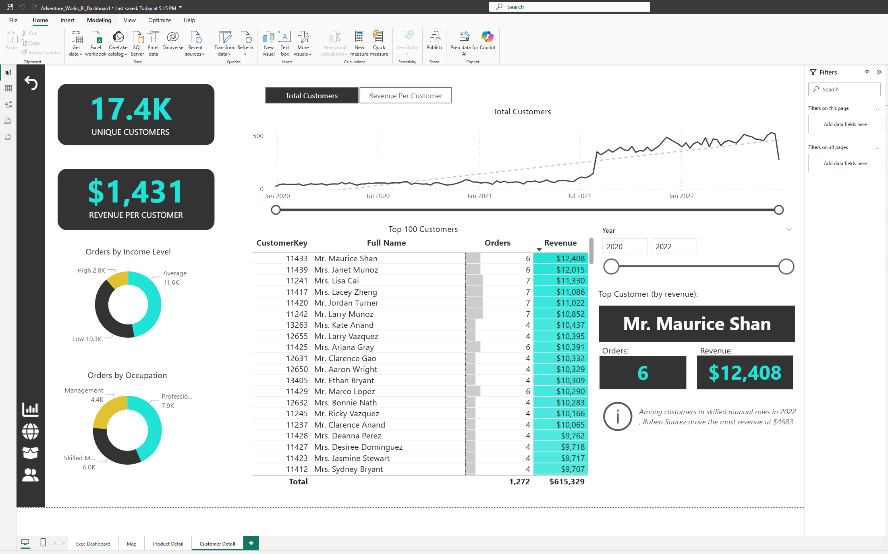

# adventure-works-sales-customer-insights-report
Interactive Power BI dashboard analyzing sales performance, customer behavior, product trends, and regional insights using the Adventure Works dataset.

# Adventure Works Power BI Dashboard

## 📊 Overview

This project is an interactive Power BI dashboard built using the Adventure Works dataset.
It focuses on analyzing business performance across sales, products, customers, and regions.

The dashboard is designed to support data-driven decision-making by providing clear insights into revenue trends, customer behavior, and product performance.

---

## 🚀 Key Features

* KPI tracking (Revenue, Profit, Orders, Return Rate)
* Monthly revenue trend analysis
* Product and category performance breakdown
* Customer segmentation and top customer analysis
* Geographic sales insights using map visualization
* What-if analysis using price adjustment parameter

---

## 📌 Business Insights

* Revenue shows a consistent upward trend over time.
* Accessories category drives the highest order volume.
* Some products have higher return rates, indicating potential quality or expectation issues.
* North America contributes the highest revenue among regions.
* High-value customers contribute significantly to overall revenue.

---

## 📸 Dashboard Screenshots

### Executive Dashboard

### Map Analysis

### Product Analysis

### Customer Analysis

---

## 🛠 Tools & Technologies

* Power BI
* DAX
* Data Modeling
* Data Visualization

---

## 📁 Download Dashboard

👉 [Download Power BI File](Adventure_Works_BI_Dashboard.pbix)

---

## 🎯 Purpose

This project is part of my data analytics portfolio to demonstrate business intelligence, dashboard design, and storytelling skills using Power BI.

